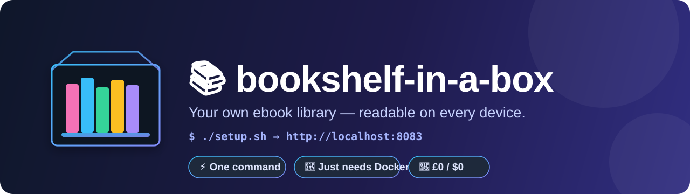
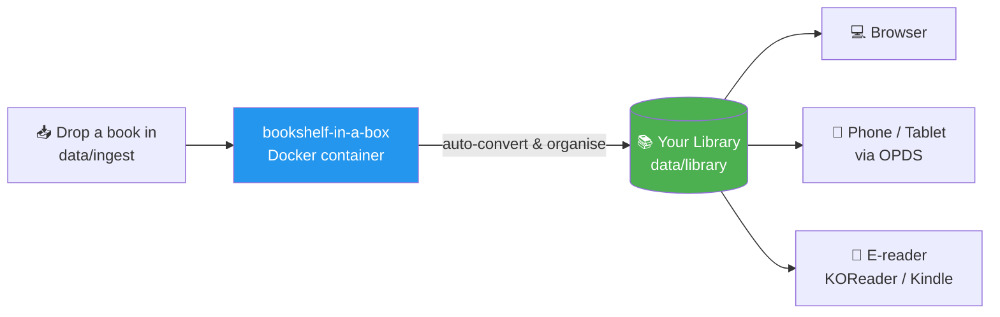

<p align="center">
  
</p>

<h1 align="center">📚 bookshelf-in-a-box</h1>

<p align="center">
  <strong>The free, open-source, one-command self-hosted ebook server.</strong><br>
  Host the books you own on your own hardware and read them on your phone, tablet, e-reader, and browser — anywhere.<br>
  <em>No coding. No subscriptions. Set up in under 10 minutes.</em>
</p>

<p align="center">
  
  
  
  
  
  <a href="https://github.com/mohitagw15856/bookshelf-in-a-box/actions"></a>
  <a href="https://github.com/mohitagw15856/bookshelf-in-a-box/releases"></a>
</p>

<p align="center">
  <a href="https://mohitagw15856.github.io/bookshelf-in-a-box/"><strong>🖥️ Try the live demo</strong></a> &nbsp;·&nbsp;
  <a href="#-quick-start-3-steps">🚀 Quick Start</a> &nbsp;·&nbsp;
  <a href="#-read-on-your-devices">📱 Read anywhere</a> &nbsp;·&nbsp;
  <a href="#-access-from-anywhere">🌍 Remote access</a> &nbsp;·&nbsp;
  <a href="#-troubleshooting">🛠 Troubleshooting</a> &nbsp;·&nbsp;
  <a href="#-faq">❓ FAQ</a>
</p>

<p align="center"><sub>👉 <a href="https://mohitagw15856.github.io/bookshelf-in-a-box/">See what your library will look like</a> — an interactive, click-through preview (no install needed).</sub></p>

---

## What is bookshelf-in-a-box?

**bookshelf-in-a-box is a free, open-source, self-hosted ebook server that you set up with a single command.** It turns any spare computer — an old laptop, a Raspberry Pi, or a mini PC — into your own personal ebook library, like a private Netflix for your books. You drop your ebooks into one folder and they instantly appear in a clean web library you can open from your **phone, tablet, e-reader, or any web browser** — at home, or from anywhere in the world with one extra free app.

It works by wrapping the proven, open-source [**Calibre-Web Automated**](https://github.com/crocodilestick/Calibre-Web-Automated) project in a Docker container. This repo's job is to make that **beginner-proof**: one script checks everything, sets it all up, and tells you exactly what to do next — no technical knowledge required.

### At a glance

| | |
|---|---|
| 💻 **What it is** | A self-hosted ebook library server (Calibre-Web Automated, made easy) |
| ⚡ **Setup** | One command — `./setup.sh` (macOS/Linux/Pi) or `./setup.ps1` (Windows) |
| 📦 **Requirements** | Just [Docker](https://www.docker.com/products/docker-desktop/) — no Node, no Python |
| 📱 **Read on** | iPhone, iPad, Android, Kindle, Kobo, KOReader, any web browser (via OPDS) |
| 🌍 **Remote access** | Free & private with [Tailscale](https://tailscale.com/) — never port-forward |
| 💸 **Cost** | £0 / $0 — no subscriptions, no accounts, no fees |
| 🔒 **Privacy** | Your books, your hardware, nobody watching |
| 📄 **License** | MIT (this wrapper) |

### Why you'll want it

- 📖 **Own your library.** Your books live on *your* hardware, not a company's cloud that can change its terms or disappear.
- 🌍 **Read everywhere.** The same library on your phone on the train, your tablet on the sofa, your e-reader in bed.
- 💸 **£0 / $0.** No subscriptions, no accounts, no fees. Free and open-source, forever.
- 🔒 **Private.** Nobody sees what you read.
- 🔄 **Auto-organised.** Drop in a messy file; it gets converted, tagged with a cover, and filed neatly.



---

## 🚀 Quick Start (3 steps)

You need **[Docker](https://www.docker.com/products/docker-desktop/)** installed. That's the only requirement — no Node, no Python, nothing else. The setup script checks for Docker and gives you install links if it's missing.

### 1. Clone this repo

```bash
git clone https://github.com/mohitagw15856/bookshelf-in-a-box.git
cd bookshelf-in-a-box
```

### 2. Run the setup script

**macOS / Linux / Raspberry Pi:**
```bash
./setup.sh
```

**Windows (PowerShell):**
```powershell
./setup.ps1
```

The script checks Docker, creates your folders, asks a couple of easy questions (timezone, port — just press Enter to accept the defaults), starts everything, and prints your library's address plus login details.

### 3. Add your first book

Drop any `.epub`, `.mobi`, `.pdf`, `.azw3`, etc. into the **`data/ingest`** folder. Within a minute it's converted, organised, and showing in your library. ✨

> 📚 **No books yet?** Run `./bin/bookshelf seed` to download a handful of free, public-domain classics to get started.
> 🧭 **Prefer a visual guide?** `./setup.sh` opens a friendly first-run page (with a QR code for your phone). Reopen it any time with `./bin/bookshelf wizard`.

Then open **http://localhost:8083** and log in:

| | |
|---|---|
| **Username** | `admin` |
| **Password** | `admin123` |

> ⚠️ **Change this password immediately.** Go to **Admin → Edit User 'admin'** and set a strong password before anyone else can reach the server. The default is public knowledge.

---

## 📱 Read on your devices

Your library speaks **OPDS** — a universal standard that ebook apps understand. Point any OPDS-capable reading app at:

```
http://SERVER-IP:8083/opds
```

Replace **`SERVER-IP`** with the address the setup script printed (for example `http://192.168.1.50:8083/opds`). Your devices must be on the **same WiFi** as the server (for reading from *anywhere*, see [Access from anywhere](#-access-from-anywhere) below).

> **How do I find SERVER-IP?** The setup script prints it. To find it again:
> - **Linux/Pi:** `hostname -I`
> - **macOS:** System Settings → Network, or `ipconfig getifaddr en0`
> - **Windows:** `ipconfig` and look for "IPv4 Address"

### KOReader (Android, iOS, Kobo, Kindle-jailbroken, PocketBook) — *recommended*

1. Open KOReader → tap the top of the screen → the **magnifying-glass / search** icon.
2. **OPDS catalog** → tap the **`+`** (add) button.
3. Fill in:
   - **Name:** `My Bookshelf`
   - **URL:** `http://SERVER-IP:8083/opds`
   - **Username / Password:** your Calibre-Web login
4. Save, tap the catalog, browse, and download. Books open right inside KOReader.

### Moon+ Reader (Android)

1. Open Moon+ Reader → **My Shelf** → the **`+` / cloud** icon → **Net Library**.
2. Add a new catalog:
   - **Type:** Calibre / OPDS
   - **URL:** `http://SERVER-IP:8083/opds`
   - Enter your username and password.
3. Browse and download. (The paid "Pro" version has the smoothest OPDS support, but the free version works.)

### Yomu or Panels (iOS / iPadOS)

**Yomu:**
1. Open Yomu → **Settings** (gear) → **OPDS Catalogs** → **Add Catalog**.
2. **URL:** `http://SERVER-IP:8083/opds`, plus your username and password.
3. Back out to browse and download.

**Panels** (great for comics/PDF):
1. Library → **`+`** → **Connect to Server** → **OPDS**.
2. Enter the same URL and credentials.

> 💡 **Any** app that supports "OPDS" works — Marvin, KyBook, Cantook, and others. The URL is always `http://SERVER-IP:8083/opds`.

### Send to Kindle

Amazon Kindles don't do OPDS, but Calibre-Web Automated can **email books straight to your Kindle**:

1. **On Amazon:** go to *Manage Your Content and Devices → Preferences → Personal Document Settings*. Note your Kindle's `@kindle.com` email address, and **add your sending email to the "Approved Personal Document E-mail List"** (this whitelist step is required or Amazon silently drops the book — see [Troubleshooting](#-troubleshooting)).
2. **In your library:** log in as admin → **Admin → Edit SMTP Settings** and enter your email provider's outgoing (SMTP) details (e.g. a Gmail App Password).
3. **In each user's profile:** set the **"Send to Kindle" email** to the `@kindle.com` address.
4. Now open any book → **Send to Kindle**. It appears on your device shortly.

---

## 🌍 Access from anywhere

By default your library is only reachable on your home WiFi — which is exactly how it should be. To read from the outside world **safely**, use [**Tailscale**](https://tailscale.com/). It's free for personal use and creates a private, encrypted tunnel between your devices — no configuration of your router required.

> 🚫 **Do NOT "port-forward" your library to the open internet.** Opening port 8083 on your router exposes your server to the entire world and to automated attacks. Calibre-Web is not hardened to sit naked on the public internet. **Tailscale is the safe way** — it's just as easy and keeps everything private.

### Tailscale setup (about 5 minutes)

1. **Create a free account** at [tailscale.com](https://tailscale.com/) (sign in with Google/Microsoft/GitHub).
2. **Install Tailscale on the server** (the machine running bookshelf-in-a-box):
   - Linux / Raspberry Pi: `curl -fsSL https://tailscale.com/install.sh | sh` then `sudo tailscale up`
   - macOS / Windows: download the app from the website and sign in.
3. **Install the Tailscale app on your phone/tablet/laptop** and sign into the **same account**.
4. In the Tailscale admin console (or the app), find your **server's Tailscale IP** — it looks like `100.x.y.z`.
5. From any of your devices, anywhere in the world, open:
   ```
   http://100.x.y.z:8083
   ```
   and your OPDS apps use `http://100.x.y.z:8083/opds`.

That's it — private, encrypted, and free. Your library now follows you everywhere without ever being exposed to strangers.

> ✨ **Optional niceties:** Tailscale's *MagicDNS* lets you use a name like `http://bookshelf:8083` instead of the number. *Tailscale Serve* can add HTTPS. Neither is required to get going.

---

## 🔄 KOReader reading-progress sync

Read a few pages on your phone, then pick up exactly where you left off on your e-reader. KOReader has a built-in **Progress sync** plugin that does this across all your KOReader devices:

1. In KOReader on **each** device: top menu → the **gear / tools** icon → **Progress sync**.
2. **Register** a new account the first time (any username + password you like — it uses KOReader's free public sync server by default), then **Login** with the same details on every other device.
3. Set **"Sync in the background"** and/or turn on **auto-sync** so it happens automatically.
4. Open the same book on two devices — your furthest-read position now follows you between them.

> This syncs your *reading position*, and works alongside the OPDS setup above (which delivers the actual book files). Want the sync server on your own hardware too? The community [`koreader-sync-server`](https://github.com/koreader/koreader-sync-server) can be self-hosted, but the free public server is perfectly fine for most people.

---

## 🧰 Power-ups (optional extras)

Everything below is **optional** — the core library works great without any of it. There's a tiny helper so you never have to memorise Docker commands:

```bash
./bin/bookshelf help     # everything it can do
make help                # the same, via make
```

| Command | What it does |
|---|---|
| `./bin/bookshelf status` | Health, book count, disk space, last backup |
| `./bin/bookshelf doctor` | Diagnose common problems and how to fix them |
| `./bin/bookshelf seed` | Download free public-domain starter books |
| `./bin/bookshelf import <path>` | Import a folder of books or an existing Calibre library |
| `./bin/bookshelf stats` | Show library stats and write `data/stats.html` |
| `./bin/bookshelf dashboard up` | Cinematic visual gallery of your library (port 8084) |
| `./bin/bookshelf theme <name>` | Restyle the real app (oled/midnight/sepia/contrast) |
| `./bin/bookshelf qr` | Show a QR code to add the library on your phone |
| `./bin/bookshelf kindle` | Set up &amp; test Send-to-Kindle email |
| `./bin/bookshelf open` / `wizard` | Open the library / the visual setup guide |
| `./bin/bookshelf backup` / `restore` | Back up now / restore from a backup |
| `./bin/bookshelf update` | Update to the latest version (data preserved) |

### 📚 Starter library
Empty shelf on day one? `./bin/bookshelf seed` drops a handful of beloved public-domain classics — *Pride and Prejudice*, *Frankenstein*, *Sherlock Holmes*, *Alice in Wonderland*, and more — straight into your ingest folder from [Project Gutenberg](https://www.gutenberg.org/). It's safe to re-run; it skips anything it already fetched.

### 🔒 Read from anywhere, in one command (Tailscale)
Instead of the manual Tailscale steps above, run the bundled add-on:

```bash
# put a free auth key in .env as TS_AUTHKEY=...  (login.tailscale.com/admin/settings/keys)
./bin/bookshelf tailscale up
```

Your library joins your private tailnet as `http://bookshelf:8083`, reachable from any of your devices anywhere — and still **never exposed to the open internet**. (Leave `TS_AUTHKEY` blank and grab the login link with `docker compose logs tailscale`.)

### 🔐 HTTPS on your home network (Caddy)
Tired of the browser's "Not secure" note on your LAN? Add a small HTTPS reverse proxy:

```bash
./bin/bookshelf caddy up      # serves https://bookshelf.local
```

Caddy mints its own local certificate. The first time, trust its root certificate once (see `data/caddy/data/...` or just click through on your own devices), or set a custom hostname with `CADDY_HOST` in `.env`. Plain `http://<ip>:8083` keeps working alongside it.

### 💾 Automatic nightly backups
Turn on a set-and-forget background backup:

```bash
./bin/bookshelf backups on    # nightly, keeps the newest few
```

Tune `BACKUP_CRON` and `BACKUP_KEEP` in `.env`. Restore any snapshot interactively with `./bin/bookshelf restore` — it even takes a safety snapshot of your current data first, so a restore is always undoable.

### 🖼 Nicer covers &amp; metadata
Set a free [Hardcover](https://hardcover.app/) API token as `HARDCOVER_TOKEN` in `.env` and the server will auto-fetch covers and metadata for imported books.

### 🩺 `bookshelf doctor` — fix problems fast
Stuck? Run `./bin/bookshelf doctor`. It checks Docker, ports, folder permissions, disk space, Windows/WSL path pitfalls, `.env` sanity, and container health — and prints the exact fix for anything it finds.

### 📥 Import an existing collection
Moving in from another setup? Bring your books along:

```bash
./bin/bookshelf import ~/Downloads/my-books          # copy a folder of ebooks in
./bin/bookshelf import "~/Calibre Library" --adopt   # adopt an existing Calibre library wholesale
```

It only ever **copies** (never deletes the source), and skips anything it already imported.

### 📊 Library stats
`./bin/bookshelf stats` prints a summary — total books, formats, top authors, recent additions — and writes a shareable `data/stats.html` you can open in any browser.

### ✨ Cinematic visual gallery
A gorgeous, self-hosted view of your collection built from your own covers:

```bash
./bin/bookshelf dashboard up      # → http://localhost:8084
```

You get eight views in one app: a **cover wall**, a draggable **3D shelf**, a Spotify-style **"Wrapped"** recap, **insights** (a books-added heatmap + charts), a **galaxy** map of authors, an ambient **screensaver** for a spare tablet/TV, a downloadable **mosaic poster**, and a **pairing card + share banner** (with a live QR). [Try it with sample data →](https://mohitagw15856.github.io/bookshelf-in-a-box/gallery/)

### 🎨 Theme the actual app
Restyle the real Calibre-Web reading UI — no fork, no rebuild:

```bash
./bin/bookshelf theme oled        # true-black · also: midnight | sepia | contrast
./bin/bookshelf theme off         # back to default
```

A small nginx proxy injects a stylesheet from `web/themes/` — copy one to craft your own.

### ☁️ Off-site (cloud) backups
Local backups protect against mistakes; off-site backups protect against a dead disk or a house fire. Uses [rclone](https://rclone.org/) (Google Drive, Backblaze B2, S3, Dropbox, …) in a container — nothing to install:

```bash
./bin/bookshelf offsite setup     # one-time: pick your cloud (use a "crypt" remote to encrypt)
# set OFFSITE_REMOTE=... in .env, then:
./bin/bookshelf offsite sync      # push ./backups to the cloud now
```

Automate it with the scheduler overlay: `docker compose -f docker-compose.yml -f docker-compose.offsite.yml up -d offsite`.

### 🔔 Notifications
Get pinged when a backup runs or fails. Set `NOTIFY_KIND` (`ntfy` / `discord` / `slack` / `telegram` / `webhook`) and `NOTIFY_URL` in `.env`, then test with `./bin/bookshelf notify test`. Backups send a note automatically once it's configured.

### 📨 Send-to-Kindle, made foolproof
`./bin/bookshelf kindle` collects your email (SMTP) details and **sends a real test email** so you know they work *before* you paste them into the library — then prints exactly where to put them.

### 📖 Self-hosted KOReader sync &amp; Kobo sync
Keep your reading position private by running the KOReader sync server on your own box:

```bash
./bin/bookshelf kosync up     # then point KOReader at https://<server-ip>:7200
```

**Kobo** readers can sync natively from Calibre-Web — enable it in **Admin → Feature Configuration → Kobo sync** and add your Kobo using the sync URL shown there (works great alongside the Caddy HTTPS add-on).

### ♻️ Automatic updates
Hands-off updates, scoped so they only touch bookshelf's container:

```bash
./bin/bookshelf autoupdate on     # Watchtower checks daily (WATCHTOWER_SCHEDULE in .env)
```

Best paired with nightly backups so you can always roll back with `restore`.

### 🖥️ Run as a boot service (Linux)
On a headless mini-PC or Raspberry Pi, start the library automatically on power-up:

```bash
sudo ./bin/bookshelf service      # installs a systemd unit (undo: sudo ./scripts/install-service.sh --uninstall)
```

---

## 🛠 Troubleshooting

<details>
<summary><strong>My book isn't showing up after I dropped it in the ingest folder</strong></summary>

- Give it a minute — conversion of large files (or PDFs) takes a moment. Watch it happen with `docker compose logs -f`.
- **Make sure you dropped the file in the right folder:** it must go into `data/ingest` *inside the project folder*, not just anywhere.
- **Windows / WSL path gotcha:** if you're on Windows, keep the whole `bookshelf-in-a-box` folder inside your Linux/WSL filesystem **or** your Windows user folder — not on a path that mixes the two. Files copied into a Windows folder that Docker Desktop isn't sharing won't be seen by the container. The simplest fix: put the project under your home directory and copy books there with the normal file explorer.
- Check permissions: the container writes as user `1000:1000` by default. On Linux, `./setup.sh` sets folder ownership for you; if you created folders manually as root, run `sudo chown -R 1000:1000 data`.
- A file that fails to convert is left in `data/ingest`. Check the logs for the reason (a corrupt or DRM-protected file can't be imported).
</details>

<details>
<summary><strong>My library is on a NAS / network share (SMB, NFS) and books won't import</strong></summary>

Network shares don't support the same file-change notifications as local disks, so the auto-import watcher can miss new files. Fix it by enabling network-share mode:

1. Open the **`.env`** file.
2. Set both:
   ```
   NETWORK_SHARE_MODE=true
   CWA_WATCH_MODE=poll
   ```
   `NETWORK_SHARE_MODE` disables SQLite write-ahead logging (needed on NFS/SMB), and `CWA_WATCH_MODE=poll` switches the ingest watcher to polling, which reliably notices new files on mounted shares.
3. Recreate the container: `./bin/bookshelf up` (or `docker compose up -d`).
</details>

<details>
<summary><strong>"Send to Kindle" isn't delivering</strong></summary>

- **Whitelist your sender:** on Amazon → *Manage Your Content and Devices → Preferences → Personal Document Settings*, your **sending email address must be in the "Approved Personal Document E-mail List"**. Amazon silently discards documents from any other address.
- Double-check the destination is the exact `@kindle.com` address for that device.
- Verify your SMTP settings under **Admin → Edit SMTP Settings**. With Gmail you must use an **App Password**, not your normal password.
- Very large files may be rejected — converting to EPUB/AZW3 first (which this project does automatically) usually helps.
</details>

<details>
<summary><strong>Port 8083 is already in use / the site won't load</strong></summary>

Something else on your machine is using the port. Change it:

1. Open **`.env`** and set a different port, e.g. `PORT=8090`.
2. Run `docker compose up -d` again.
3. Your library is now at `http://localhost:8090` (and `:8090` for OPDS).

To see what's using a port: `sudo lsof -i :8083` (macOS/Linux) or `netstat -ano | findstr :8083` (Windows).
</details>

<details>
<summary><strong>I can reach it on the server but not from my phone</strong></summary>

- Make sure both devices are on the **same WiFi network** (guest networks are often isolated — use the main one).
- Use the **`SERVER-IP` address**, not `localhost` (localhost only means "this device").
- Check the server's firewall isn't blocking the port. On Linux you may need `sudo ufw allow 8083`.
- For access away from home, set up [Tailscale](#-access-from-anywhere).
</details>

<details>
<summary><strong>How do I completely reset / start over?</strong></summary>

Stop the container with `docker compose down`. Your data is in `data/`. To wipe *everything* and start fresh, delete the `data/` folder (⚠️ this removes your library!) and re-run `./setup.sh`. To reconfigure just the port/timezone, delete `.env` and re-run the setup script.
</details>

---

## ❓ FAQ

**Is this legal?**
The software is 100% legal and open-source. It is a tool for hosting books **you legitimately own** — books you bought, downloaded from legal free sources (Project Gutenberg, Standard Ebooks, public-domain archives), or created yourself. Please respect copyright: don't use it to distribute books you don't have the right to share. See the [legal note](#-legal-note) below.

**Do I need to know how to code?**
No. If you can install an app and copy a file into a folder, you can run this.

**Does my server need to stay on?**
Only when you want to read. Many people leave a Raspberry Pi or old laptop running 24/7 (it sips power). Or just turn it on when you want to browse — `restart: unless-stopped` means it comes back automatically after a reboot.

**Where are my books actually stored?**
In the `data/library` folder inside the project. That folder *is* your library — back it up (there's a script for that) and you'll never lose anything.

**Can multiple people use it?**
Yes. As admin, create additional users under **Admin → Add New User**, each with their own login, send-to-Kindle address, and reading progress.

**How do I back up?**
Run `./scripts/backup.sh` — it makes a timestamped archive in `backups/` and keeps the last 7. There's a ready-to-use nightly cron example inside that script.

**How do I update to the newest version?**
Run `./scripts/update.sh`. It pulls the latest image and restarts, without touching your data.

**What file formats work?**
EPUB, MOBI, AZW3, PDF, CBZ/CBR (comics), FB2, and more. With `CWA_AUTOCONVERT=true` (the default), incoming books are auto-converted to EPUB for the widest compatibility.

---

## 💻 Hardware suggestions

You don't need anything fancy. Great choices:

| Hardware | Notes |
|---|---|
| **An old laptop** | Perfect starter — you already own it. Close the lid and tuck it on a shelf (disable sleep-on-lid-close). |
| **Raspberry Pi 4 or 5** | The classic low-power always-on option. Use a **64-bit OS** and boot from an **SSD** (or good-quality SD card) for best results. The image supports ARM out of the box. |
| **A mini PC** (Intel N100 & similar) | Cheap, silent, tiny, and comfortably powerful for a whole household. |
| **A NAS** (Synology, etc.) | Works if it runs Docker — remember to set `NETWORK_SHARE_MODE=true` if the library sits on a network volume. |

**Rule of thumb:** ~2 GB RAM is plenty for personal use; more only helps if lots of people convert big files at once. Storage is simply "however big your library is."

---

## ⚖️ Legal note

bookshelf-in-a-box is a **self-hosting tool for your own legally-obtained books**. It does not include, distribute, or help you find any copyrighted content. Use it for books you have purchased, books you have created, or freely-licensed and public-domain works (e.g. [Project Gutenberg](https://www.gutenberg.org/), [Standard Ebooks](https://standardebooks.org/)). Respect the copyright laws in your country. The authors of this project accept no responsibility for misuse.

---

## 🤝 Contributing

Contributions, bug reports, and setup-help questions are very welcome — especially anything that makes life easier for non-technical users. See [CONTRIBUTING.md](CONTRIBUTING.md) and the issue templates.

---

## 🙏 Credits

This project stands entirely on the shoulders of others:

- **[Calibre-Web Automated](https://github.com/crocodilestick/Calibre-Web-Automated)** by [crocodilestick](https://github.com/crocodilestick) — the actual ebook server and auto-import engine that does all the heavy lifting. This repo is just a friendly wrapper around their fantastic work. ❤️
- **[Calibre-Web](https://github.com/janeczku/calibre-web)** — the web reader Calibre-Web Automated builds on.
- **[Calibre](https://calibre-ebook.com/)** by Kovid Goyal — the ebook-management foundation of the whole ecosystem.
- **[KOReader](https://github.com/koreader/koreader)**, **[Tailscale](https://tailscale.com/)**, and the wider self-hosting community.

If you find bookshelf-in-a-box useful, please go **star the upstream [Calibre-Web Automated](https://github.com/crocodilestick/Calibre-Web-Automated) project** too.

---

## 📄 License

Released under the [MIT License](LICENSE). Calibre-Web Automated, Calibre-Web, Calibre, and other referenced projects are the property of their respective authors and carry their own licenses.

<p align="center">
  
</p>
<p align="center"><sub>Made for people who just want to read their own books, everywhere. 📚</sub></p>
<p align="center"><sub>self-hosted ebook server · Calibre-Web Automated setup · Docker ebook library · read ebooks on any device · OPDS server</sub></p>
